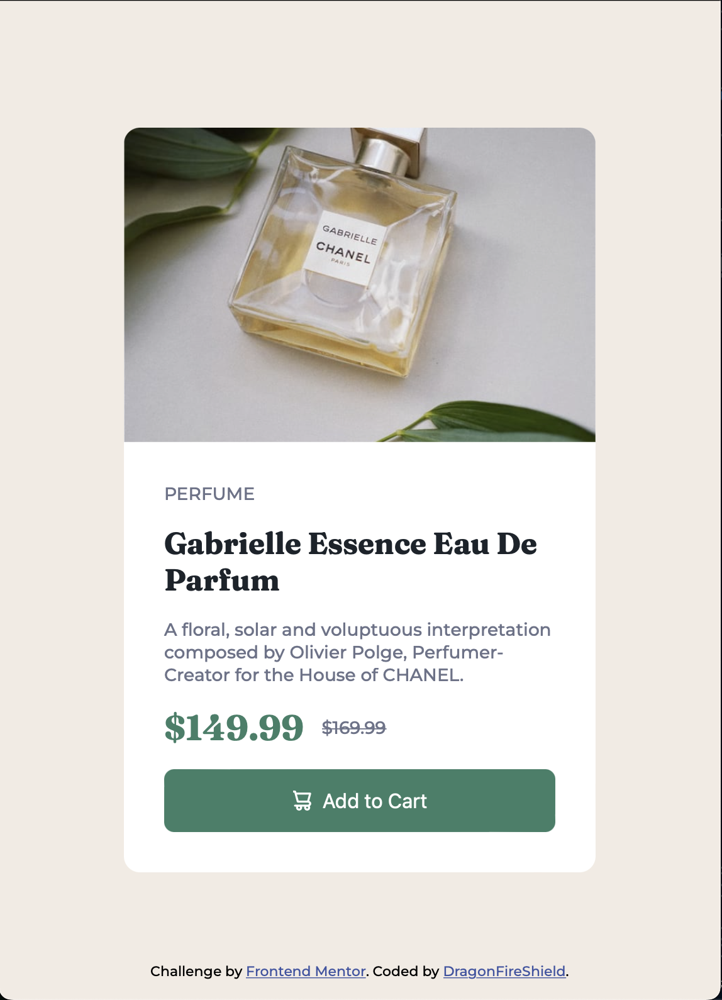
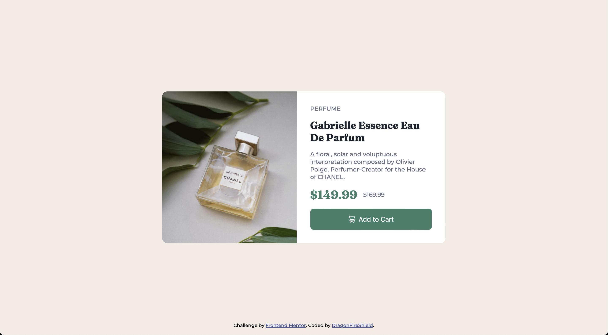

# Frontend Mentor - Product preview card component solution

This is a solution to the [Product preview card component challenge on Frontend Mentor](https://www.frontendmentor.io/challenges/product-preview-card-component-GO7UmttRfa). Frontend Mentor challenges help you improve your coding skills by building realistic projects. 

## Table of contents

- [Overview](#overview)
  - [Screenshot](#screenshot)
  - [Links](#links)
- [My process](#my-process)
  - [Built with](#built-with)
  - [What I learned](#what-i-learned)
  - [Continued development](#continued-development)
- [Author](#author)
- [Acknowledgments](#acknowledgments)

## Overview

### Screenshot

### Links

- Solution URL: [Add solution URL here](https://your-solution-url.com)
- Live Site URL: [Add live site URL here](https://your-live-site-url.com)

## My process

### Built with

- Semantic HTML5 markup
- CSS custom properties
- Flexbox
- Mobile-first workflow

### What I learned

I tend to over complicate things, but it's usually solved by removing some hard-coded widths and heights. This challenge made me realise I don't fully grasp how images are being displayed in the browser.

### Continued development

Focus on making more card designs in different orientations and sizes to get a solid understanding of the box model, flex and images. Add dark mode button.

## Author

- GitHub - [@dragonfireshield](https://github.com/DragonFireShield)
- Frontend Mentor - [@dragonfireshield](https://www.frontendmentor.io/profile/dragonfireshield)
- Twitter - [@shieldfordragon](https://www.twitter.com/shieldfordragon)

## Acknowledgments

Got some help from the awesome people over at Kevin Powell's Discord. https://discord.gg/uenPPuJq
